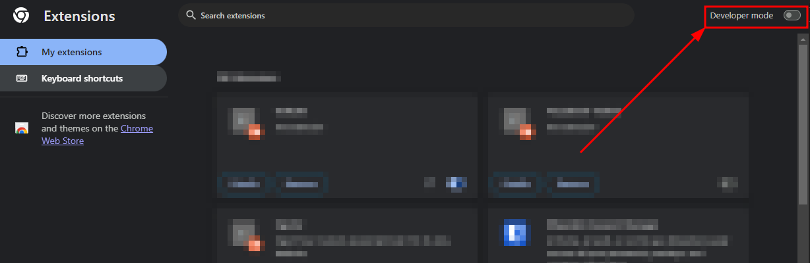
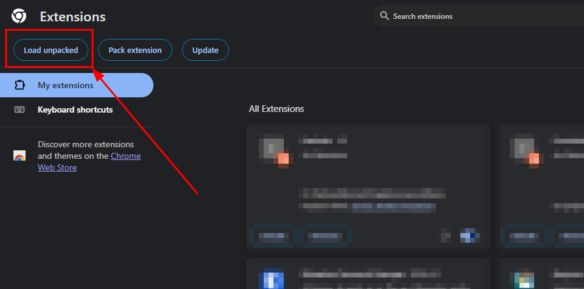
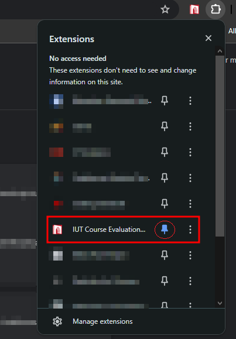
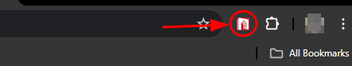
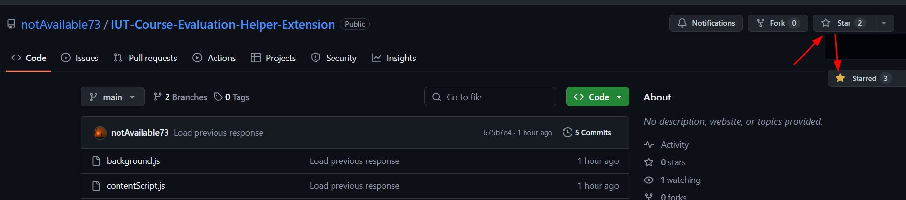

# IUT Course Evaluation Helper Extension

This browser extension is designed to help IUT students quickly complete their course evaluations each semester. It will only work on [IUT-SIS](https://sis.iutoic-dhaka.edu) for evaluating the courses.

## Introduction

For **IUT students**, evaluating each course every semester involves answering around 36 questions: 9 are text boxes, and 27 are radio buttons where students rate from 1 to 5 stars. This process is very time-consuming, especially with 10 or more courses to evaluate.

This extension is created to save time. With one click, all questions will be filled with your provided values. Three questions are skipped as we believe those questions are important to be filled by students.

## Download and Installation Guide

This is a browser extension for Chrome and other Chromium-based browsers like Microsoft Edge.

1. **Download the Extension**
   - Click on [this link](https://github.com/notAvailable73/IUT-Course-Evaluation-Helper-Extension/archive/refs/heads/main.zip) to download the extension files.
   - Extract the downloaded file.

2. **Install the Extension**
   - Open your Chrome or Edge browser.
   - Go to the Extensions page by clicking on the three dots at the top right corner, then selecting `Extensions` > `Manage Extensions`.
   - Turn on **Developer mode**. You can find the switch at the top right of the Extensions page.
     - 
   - Click on the `Load unpacked` button.
     - 
   - Select the folder where you downloaded and extracted the extension files.
   - The extension will be installed, and you will see it in the list of extensions. Pin it to use it comfortably.
     - 

## How to Use the Extension

1. **Enable the Extension**
   - The extension icon will appear next to the address bar in your browser.
     - 
   - Go to [SIS-Evaluation](https://sis.iutoic-dhaka.edu/evaluation-list) to evaluate any course. Select any course that has not been evaluated.
   - If the page was already visited before installation, please reload the page.
   - Click on the extension icon next to the address bar.
   - Provide your input values and then click submit.
## Like the project?
   - Don't forget us from your Du'a! 🤲
   - If you like the project, please consider giving it a star ⭐️
      - 

## Troubleshooting

- If you don't see the extension icon, make sure it's enabled.
- If you face any issues, try reloading the extension by turning Developer mode off and on again, then click `Load unpacked` and select the folder again.
