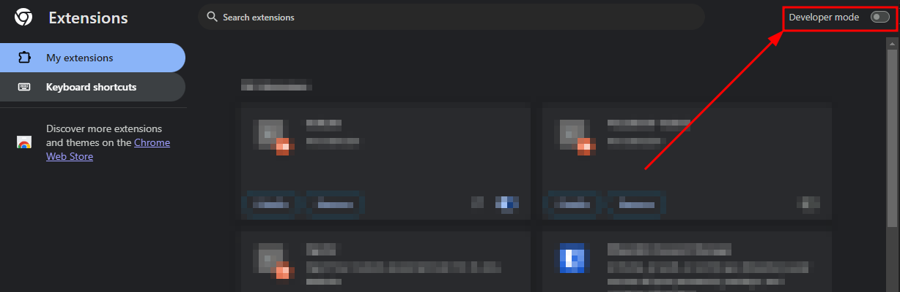
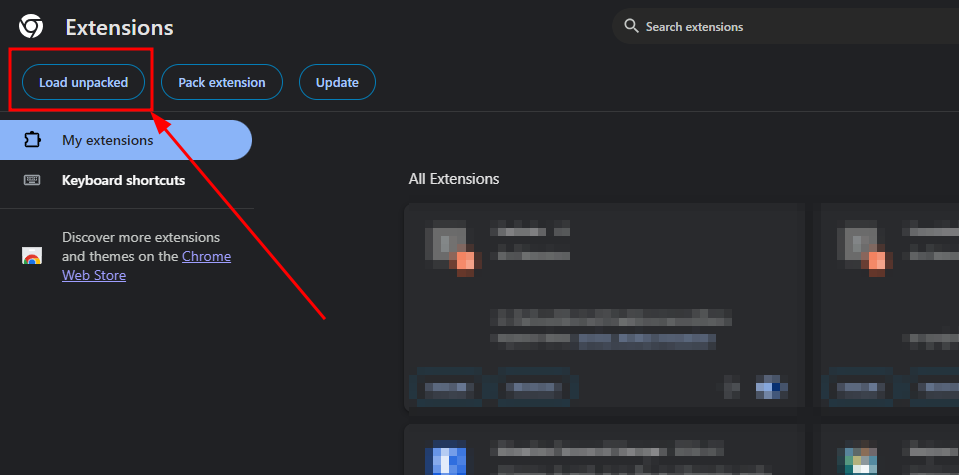
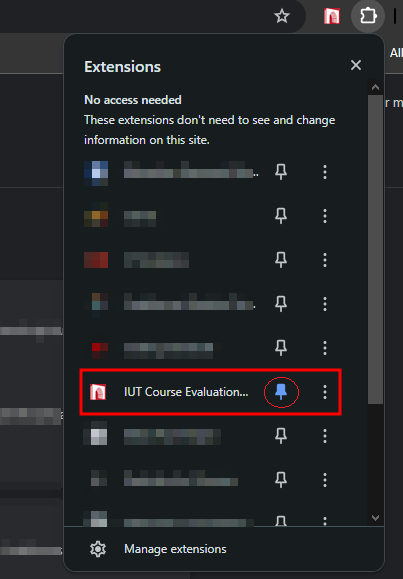
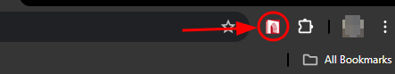
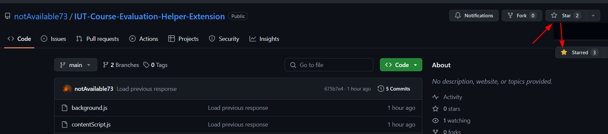

# IUT Course Evaluation Helper Extension

IUT Course Evaluation Helper is a Chromium browser extension for quickly filling IUT SIS course evaluation forms.

It works only on:

- `https://sis.iutoic-dhaka.edu/evaluate-course/*`
- `https://sis.iutoic-dhaka.edu/evaluation-list*`

## Features

- Save a default numeric rating from 1 to 5.
- Save reusable text feedback.
- Fill and submit the currently opened course evaluation form.
- Submit all course links found on the SIS evaluation list page.
- Show success and error status directly inside the popup.
- Link users to the project repository to give it a star.
- Use only the required SIS host permission instead of broad all-site access.

## Installation

This extension works in Chrome, Microsoft Edge, and other Chromium-based browsers.

1. Download the extension source code from GitHub.
2. Extract the downloaded archive.
3. Open your browser's Extensions page.
4. Enable **Developer mode**.

   

5. Click **Load unpacked**.

   

6. Select the extracted extension folder.
7. Pin the extension from the browser toolbar.

   

## Usage

### Fill and Submit One Course

1. Open an unevaluated course from `https://sis.iutoic-dhaka.edu/evaluation-list`.
2. If the page was opened before installing or reloading the extension, refresh the page.
3. Click the extension icon.

   

4. Select the default rating and enter text feedback.
5. Click **Fill & Submit Current Course**.
6. The extension fills the form, clicks the SIS submit button, and returns the tab to `https://sis.iutoic-dhaka.edu/evaluation-list`.

### Evaluate All Listed Courses

1. Open `https://sis.iutoic-dhaka.edu/evaluation-list`.
2. Click the extension icon.
3. Select the default rating and enter text feedback.
4. Click **Evaluate All Listed Courses**.
5. Wait for the popup status message to show how many course submissions succeeded.

## Notes

- The extension can only work while you are logged in to SIS.
- If SIS changes its course evaluation form or API, the bulk submit feature may need an update.
- The popup disables actions that do not apply to the current page.

## Troubleshooting

- If the popup says to open an SIS evaluation page, make sure the active tab is on the course evaluation form or evaluation list.
- If the extension was loaded after a SIS page was already open, reload that SIS page.
- If a bulk submission fails, confirm that you are logged in and that course links are visible on the evaluation list.
- If the extension icon is missing, confirm that the extension is enabled and pinned.

## Like the Project?

- Don't forget us from your Du'a! 🤲
- If you like the project, please consider giving it a star: `https://github.com/notAvailable73/IUT-Course-Evaluation-Helper-Extension`
- The popup also includes a GitHub star link.

  
